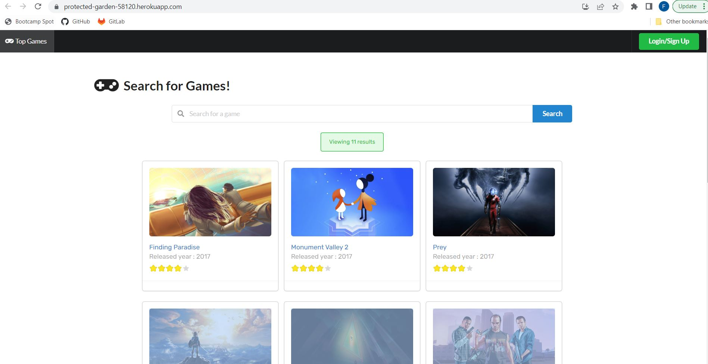

# TheGamingSpotProject

This is a Gaming Library Project that me and a few of my class mates worked on together.

[](https://opensource.org/licenses/MIT)

A Gaming Library Application 

## Description

This application allows users to search games and leave reviews. Users would have to login or signup to use the application. Also implementing features to add games to the user’s library and marking favorite games. Users will be able to manage their game libraries when logged into their account.


## User Story 
```
AS A gamer,
I WANT to  search games and leave reviews,
SO THAT I can provide recommendations for other gamers,
I WANT to see games come up for certain genres I look up as a user.
I WANT to be able to save/add games to the user's library.
```

## Visual




## Technologies Used

HTML, Tailwind.css, JavaScript, RAWG Video Games API, React, Express, Node.js, Handlebars


## Links

[GitHub Repo](https://github.com/fdirige/The-Gaming-Spot)

[Deployed Link](https://protected-garden-58120.herokuapp.com/)


## Authors

Frederick Dirige, Jairo Osorio Ramirez, Andrey Shestopal, Kate Sundquist, Oscar Macias


## License

[](https://opensource.org/licenses/MIT)

[MIT License](https://opensource.org/license/mit-0/)

For the full text of this license, please click on the link provided.
